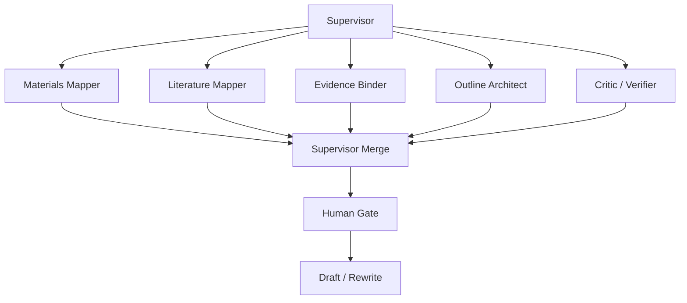

# Thread Model: Supervisor + 4-5 Workers

논문 작성에서 multi-thread를 쓰는 이유는 더 많은 AI를 부리기 위해서가 아니라, 서로 다른 사고 작업을 분리하기 위해서입니다.

## 기본 구조

## Supervisor가 하는 일

- 작업을 작게 나눈다.
- worker에게 입력, 산출물, 금지사항을 명확히 준다.
- worker 결과를 합친다.
- 충돌하는 판단을 표시한다.
- human-only gate를 넘기 전에 멈춘다.

Supervisor가 하지 않는 일:

- 근거 검토 없이 바로 본문을 길게 쓰기
- worker를 계속 추가하기
- worker 완료 전에 다음 단계로 이동하기
- risk memo 없이 final draft처럼 포장하기

## Worker 5개

| Worker | 맡길 일 | 산출물 |
|---|---|---|
| Materials Mapper | 제공 자료의 종류와 사용 가능 범위 정리 | `materials-inventory.md`, `do-not-claim.md` |
| Literature Mapper | 벤치마크 논문, 이론 흐름, 관련 연구 위치 정리 | `benchmark-papers.md`, `findings-summary.md` |
| Evidence Binder | claim과 source 연결 | `evidence-bindings.md` |
| Outline Architect | section architecture와 paragraph target 작성 | `section-architecture.md`, `argument-outline.md` |
| Critic / Verifier | 초안 위험, 과장, 인용 누락 검토 | `draft-risk-report.md`, `review-report.md` |

## 권장 phase gate

1. **자료 감사 gate**: 무엇을 쓸 수 있고, 무엇을 쓰면 안 되는가?
2. **근거 연결 gate**: section별 claim-source 연결이 있는가?
3. **목차 gate**: 논문 구조가 자료 범위와 맞는가?
4. **초안 gate**: allowed claim만 사용했는가?
5. **비평 gate**: 과장, citation gap, privacy risk가 정리되었는가?
6. **인간 승인 gate**: 외부 공유 전에 사람이 판단했는가?

## 실패 패턴

- "논문 전체 써줘"로 시작한다.
- 한 thread에서 자료 읽기, 문헌 검토, 초안, 비평을 모두 처리한다.
- worker를 너무 많이 만들어 merge가 더 어려워진다.
- supervisor가 worker 산출물을 검토하지 않고 그대로 붙인다.
- citation needed를 reference처럼 보이게 꾸민다.

## 1시간 워크숍에서 보여줄 최소 데모

1. supervisor prompt를 보여준다.
2. 5개 worker 역할을 보여준다.
3. `evidence-bindings.md`와 `risk memo`를 보여준다.
4. 최종 초안은 "AI가 혼자 쓴 글"이 아니라 "근거와 위험을 붙인 초안 패키지"라고 설명한다.
